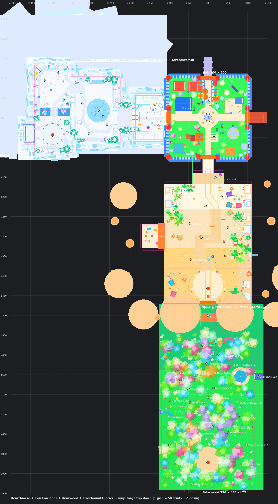

# First slice: Hearthmere → Iron Lowlands → Iron Warlord → sword → hub

Status (2026-09-15): geometry, markers, map-aware gameplay, travel and validation are implemented
and pass static/build checks. **Not yet playtested in Studio.** See "Verification" below.



## How to run it

The map lives in its own Rojo project so the gameplay-only baseline stays untouched.

```sh
python3 tools/map_forge.py                                   # regenerate lemonade-map/ + preview
rojo build map.project.json -o /tmp/lemonade-map.rbxlx
python3 tools/check_map_project.py /tmp/lemonade-map.rbxlx --report docs/map/VALIDATION.md
python3 tools/luau_balance_check.py lemonade-game
rojo serve map.project.json --port 34873                     # connect Studio's Rojo plugin to 34873
```

Use a **copy** of the baseplate place for map work (File → Save As). Rojo keeps unknown instances,
so a place that has been synced with the map project keeps `Workspace.LemonadeMap` and the map
scripts after disconnecting. The default project still works there: gameplay switches to map mode
whenever `MapMarkers` and `Workspace.LemonadeMap/Markers` are both present.

| Project | Adds | Mode |
| --- | --- | --- |
| `default.project.json` | gameplay only (18 server, 13 client) | baseplate |
| `map.project.json` | default + `Workspace.LemonadeMap`, `MapMarkers`, `MapTravel`, `MapClient`, `HubAmbience` | map |

`tools/check_map_project.py` fails if `map.project.json` drops or changes any default mapping.

## Layout (studs; +X east, +Z south, floors rest on the Baseplate at Y=0)

| Area | Extent | Floor top | Contents |
| --- | --- | --- | --- |
| Hearthmere hub | x −100..100, z −100..100 | 10 | spawn (0,−40) facing the south gate; plaza + sword monument; Sword Shop (W), Skill Trainer yard (E), Rebirth Shrine (SE), Quest Master in a striped market stall beside the south road (15,50); sealed gates W/E/N and Void Rift portal (NE) with visible vistas |
| Pass | x −14..14, z 104..140 | 10 | canyon pass from the hub gate |
| Quarry Overlook | x −40..40, z 140..168 | 10 | safe staging area, waystone, route sign; 32-stud ramp down (14°) |
| Squire Yard | z 200..265 | 2 | 5 Squires Lv 1–3, spaced 35–41 studs; tents, campfire, scaffolds at the edges |
| Crusher Pits | z 270..360 | 2 | Squires Lv 3–4 + Berserkers Lv 3–5; rail line, crane, stone stacks |
| Side passage | x −167..−110, z 283..347 | 2 | optional elite Berserker Lv 6, supply cache (decorative for now) |
| Warlord's Gate | (0, 352) | 2 | waystone, boss sign; 40-stud gap in a rock ridge shows the boss early |
| Warlord's Pit | centre (0, 424), r 42 | 2 | Iron Warlord Lv 10, standing stones, braziers, banners |
| Briarwood gate | (0, 470) | 2 | sealed milestone "Lv 9+" with forest vista |

Measured on the navigation grid (`docs/map/VALIDATION.md`): spawn → Iron Lowlands gate 8.8 s
walking; first enemy 16 s (10 s running); boss 29 s (18 s); nearest-encounter spacing 1.6–2.6 s.
Merchant/trainer/quest/rebirth are 4–5.5 s from spawn.

## Decisions

- **Classic Parts, generated.** `tools/map_forge.py` is the source of truth; `lemonade-map/` is its
  output (do not hand-edit). Seeded jitter keeps cliffs irregular but reproducible.
- **Collision separate from visuals.** Cliff chunks never collide; `LemonadeMap/Collision` holds
  invisible wall proxies. Floors live in `Grounds_<Region>` so enemy ground raycasts hit only floors.
- **Flat combat floors,** height only at the overlook (staging) and the hub step; no terrain.
- **Every region has a readable entrance, landmark, enemy family and boss** (hub gate sign, crane, ridge gap).
- **Sealed destinations are visible,** not hidden: barred gates with level labels and a vista behind.
- **Existing identities kept.** Spawn markers reuse `IronSquire`, `IronBerserker`, `Boss_Gorgon` and the
  `IronLowlands` quest zone, so quests q1–q5, kill attribution, drops and saves are unchanged.
- **Zones without markers stay idle** in map mode (logged once), rather than falling back to the
  baseplate ring. Only Iron Lowlands has markers in this slice.
- **Travel:** discovering a waypoint (walk within 18 studs or use its waystone) unlocks it, saved in
  the `DiscoveredWaypoints` attribute. Waystones open a menu of discovered destinations; Return to
  Hub works from anywhere. The server validates discovery, waystone proximity, cooldown and combat.
- **Unlock rule (tuning assumption):** regions are gated by visible recommended levels only; the one
  playable region is open. Sealed gates are physical until their regions exist.

## Gameplay changes shipped with this slice (also active in the baseline)

- Enemy attacks telegraph: damage lands at the end of the swing (0.32 s, heavy attackers 0.5 s) and
  only if the target is still within reach + 1.5 studs, so stepping back after the raise avoids it.
- Every enemy shows name, level and a health bar (60-stud draw distance); elites are gold "★ Elite".
- Hub NPCs have nameplates and face the direction their markers give.
- Enemies only acquire targets they can see (no aggro through cliffs or walls).
- Refused actions explain themselves (`RemoteEvents.Notify`), starting with skill reset.
- XP bar numbers are shortened (12.5K / 3.4M); the onboarding arrow tracks the real Quest Master.

Map-only guidance: a quest guide marker plus a yellow outline on the Quest Master, merchant, the
nearest living quest enemy or the boss, depending on quest state.

## Verification

| Check | Result |
| --- | --- |
| `rojo build` both projects | pass |
| `check_gameplay_project.py` (baseline contract) | pass: 18 server / 13 client, no environment services |
| `check_map_project.py` (schema, floors, overlaps, safe zones, aggro vs arrivals, camera clearance, reachability) | pass |
| `luau_balance_check.py` (64 files) | pass |
| Studio playtest 1 (user footage, 2026-09-15) | loop completed: combat, rewards, boss drop, waystone discovery, hub NPCs, notifications; fixes below |

## Playtest 1 fixes (2026-09-15)

- Waystone menu was empty and the region banner / Return to Hub never showed: the client cached
  markers at startup before they streamed in. `Markers` is now a Persistent model and the client
  reads markers on use.
- Signs: posts crossed the board faces and the Fantasy font overhung its bounds, cutting letters.
  Posts now stand outside the board, text is inset Merriweather; gate signs sit in front of caps.
- Floors crawling as the camera moved: overlapping coplanar tops z-fought (four-band octagons,
  roads under the plaza). Round surfaces are single cylinder discs; the validator now fails on
  any overlapping same-height tops.
- Roof gables were stepped blocks that poked through the roof; now wedges under the roof slabs.
- Quest Master ignored E: CombatController binds E to Attack via ContextActionService, which sinks
  the key. The Quest Master now uses a ProximityPrompt. (Baseline bug too.)
- Quest Master stands behind a new striped market stall; the blue awning and board are gone.
- Sealed gates read "Coming soon" and toast when approached; they lead to unbuilt regions.
- Removed by request: auto-attack (HUD, Q toggle, settings row, server loop, remote), auto skill
  allocation (P), OnboardingGui (welcome card, arrow, tips) and the level panel hint line.

Balance note from the footage: leveling is very fast (Lv 13 at the boss, Lv 24 after its XP).
Boss XP and the level curve need a tuning pass before Briarwood exists.

## Playtest 2 changes (2026-09-15)

- Removed the Iron Lowlands arch and signs at the pass; the hub gate already names the region.
- Sword monument assembled along its tilted axis (the hilt floated beside the blade).
- Quest Master stall; well rebuilt as a round stone rim with winch, bucket and a roof on posts.
- Rebirth shrine: hologram sword projector instead of the floating crystal.
- Waystones are glowing crystal clusters; the travel prompt sits on an invisible `PromptAnchor`.
- Doorway mid rails no longer cross the opening.
- `HubAmbience` (client, map only): Skill Trainer walks to a dummy, swings a practice sword and
  returns; hologram spins and flickers; waystone splinters orbit.

## Hearthmere life pass (2026-09-15)

Geometry (`map_forge.py`): houses got collidable plank doors, framed lit windows with flower
boxes, and smoking chimneys; a working blacksmith corner (forge fire, anvil, hammer, quench
barrel) beside the shop; benches and a flower ring around the monument; flower beds, bunting
strung over every road, a fingerpost and welcome sign by spawn with a rune ring and lamps; a
produce stall and gathering fire by the well; a waterfall and pool on the east cliff; hay,
rack, barrels, crates, woodpile, hand cart, bushes, stumps and boulders. 1931 parts total.

Motion (`HubAmbience`, client only): five villagers stroll between spots (detouring round the
monument) and chat; the smith hammers in bursts with sparks and a clink; butterflies over the
beds, three birds circling the plaza, waterfall sheets shimmer; plus the trainer, hologram and
waystone splinters from before.

## Sword economy (2026-09-15)

- `SwordValue` rates a relic sword from rarity base x modifier tier weights (+Blessed, +boss
  tier); a player's **Wealth** sums every sword carried or vaulted. It is a player attribute
  (vault and trade UIs) and a leaderstat beside Level and Rebirths; derived, never saved.
- **Vaultkeeper** (log shack NE of spawn): store up to 12 relic swords in the profile vault;
  they survive rebirths and server hops. `VaultSystem` + `VaultGui`.
- **Trading** (Menu > Trade): the tab lists players in the server first; a request notifies
  the other player (toast + menu opens on the Trade tab) to accept or decline. In a trade your
  side shows your whole inventory and vault to offer from; their side shows only their offer.
  Both confirm, any change resets confirmations, then swords swap (rebuilt from saved attrs).
  `TradeSystem`, server-authoritative.

## Known limitations / next

- `canLeaveCombat` in `MapTravel.server.luau` decides the travel combat restriction (see TODO).
- Supply cache, collection hall and a travel-board UI in the hub are decorative/placeholder.
- No keyboard/controller shortcut for Return to Hub yet (button only; menu supports gamepad/touch).
- Region lighting is untouched (Lighting is not mapped by design).
