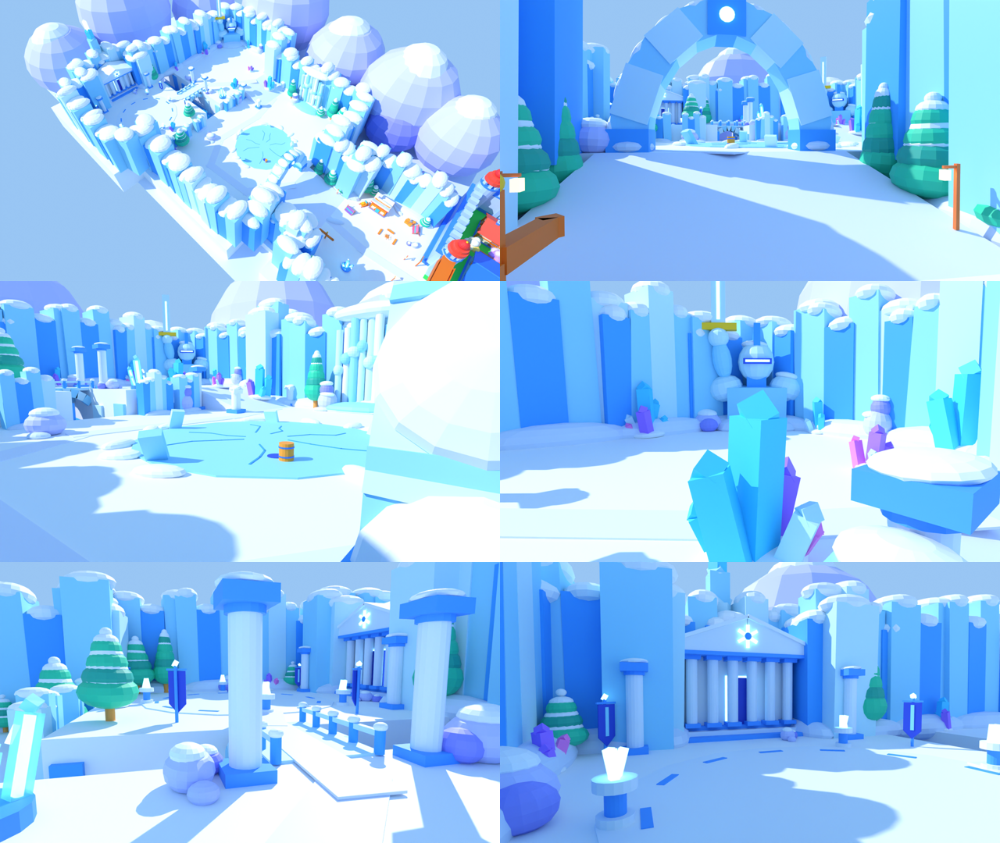
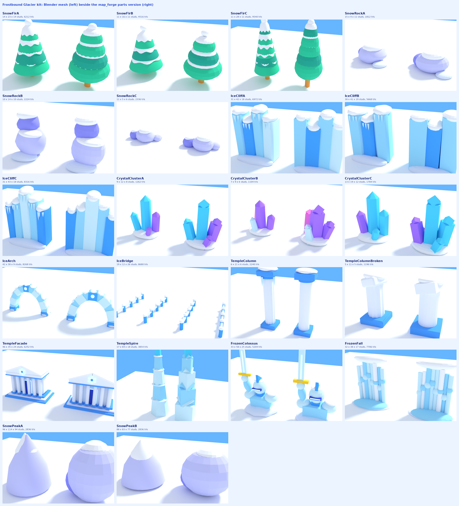

# Frostbound Glacier

The first Frostbound zone (Lv 18-25). It lies west of Hearthmere, through the hub's west gate
(`GateFrostbound`, now open). There is **no voxel terrain**: every floor is a
`Grounds_FrostboundGlacier` slab and everything you see is parts. The big pieces come from a kit
that is also modelled in Blender. Enemies are the existing FrostImp, GlacialGargoyle and
Boss_FrostRevenant: their looks are code-built (EnemyOutfits), their quests (q9-q11), drops and
spin pools were already wired, and map mode spawns them from this zone's markers.

Aerial, ascent, lake, ridge, bridge and forecourt, rendered from the parts version in Cycles.

## The route

| Area | Where (x, z) | Floor Y | What's there |
| --- | --- | --- | --- |
| Frost Hollow | −184..−104, −56..56 | 10 (corner shelves 14) | Safe zone. A timber hamlet under the ice: the two-storey lodge "The Thawed Kettle" with its lit porch, six cabins (two on each raised corner shelf behind it, one on the south yard), roofs higher still on mounds against the west cliff, every chimney smoking; amber window panes, lantern strings, a dark-ice skating pond and two fires with log benches just inside the gate, a well, sleds, banners, and snow-people (a shopkeeper, a skater, one warming by the fire). The exit arch is deep ice with a glowing rim. **Waystone 6 "Frost Hollow"** (arrival −142, 14). Level with the hub, straight through the gate. |
| The Great Ascent | −228..−186, −28..28 | 10 → 20 | A 56-wide snow ramp between fir-lined banks, two lanterns, under the **Ice Arch**. |
| Frozen Lake terrace | −350..−228, −104..64 | 20 | A cracked ice lake (r 30) with an ice-fishing hole, the **Frozen Fall** pouring off the north cliff, fir groves, crystal clusters. Four FrostImp packs (L18, L18, L19, L19), one out on the ice. |
| Gargoyle Stair | −350..−318, −100..−60 | 20 → 30 | A ramp up the ridge's ice face between temple ruins. |
| Gargoyle Ridge | −440..−350, −132..−24 | 30 | The **Frozen Colossus**: a giant ice knight half-sunk in the glacier, raising his sword. It's the milestone, seen from the lake. Big crystal fields; GlacialGargoyle L21/L22/L22 and the L23 elite. **Waystone 7 "Gargoyle Ridge"** (arrival −366, −44), just before the bridge, for short boss retries. |
| Ice bridge / Blue Crevasse | bridge x −398..−382 over z −24..−4 | 30 (floor of the crevasse 3) | The one crossing. Invisible rails and lips make the crevasse impossible to fall into. Below: the **Blue Crevasse** (`blue_crevasse`, after `glacier_refs/ice_canyon.png`): each wall is a stack of staggered ledges climbing from NAVY at the floor through COBALT and ICE to frosted ice at the lip, every proud band under a thick snow cap; above each lip ice towers 20-40 tall stand on the ridge and forecourt slabs (frosted, then near-white, a sun-warmed snow cap on top), leaning in and leaving a slot of sky over the middle, with a gap at the bridge so the deck is a pass between them; icicle curtains under the lips. West it closes on a dark cleft with a sunset glow, three translucent panes of mist across the far end, one big lit crystal field (`CrystalFieldA` x1.4) as the landmark before it and a geode on a ledge above; a lit geode mid-canyon on the north wall. The floor is a packed-snow path between navy and cobalt chunks and drifts at the walls' feet. |
| The Revenant's Forecourt | −440..−350, −4..88 | 30 | A round plaza (r 32) with an inlaid ring, four cold-fire braziers, frost banners, and a colonnade before the **Frozen Temple** (glowing doorway and snowflake crest) and its **Frozen Spire**. Boss_FrostRevenant L25, leash 30. |

Around it all, three ranks of ice stepping up and back, after `glacier_refs/glacier_valley.png`,
so that a player on the floor (camera at most 44 studs out) sees a valley, not a fence: rubble, wall,
spire, crag, mist, range, sky. The lake terrace is the valley's corridor: from the ascent's top
looking west along the frozen river to the Gargoyle Stair, the walls stand tall on the near
flanks, step down on the ridge at the far end, and the far range shows pale in the notch at the
vanishing point under open sky (render view `g_corridor`).
- **Rubble.** Knee-to-shoulder chunks of broken ice tumbled on the snow at every wall's foot
  (`wall_rubble`, laid on whatever floor is there, clear of markers and lanes).
- **The walls.** One kit piece (IceCliffA/B/C) per ~110 studs of edge, standing 15 studs outside
  the outline on the floors, which run out under them. Each is two fat slabs of deep saturated blue
  (`ICE_WALL` #1E5FD0 and `ICE_WALL_LIT`) leaning back 9-16°, 3-5 chunky shapes apiece: a rounded
  bulge at one foot, one wide two-tone crevasse (a `NAVY` strip inside an `ICE_DEEP` strip, both
  lying in the slab's own frame so they stay flush however it leans), a pale serac leaning out over
  one crest with its snow cap sunk into it, a pale shard off the other, a snow shelf sunk into each
  top, a drift along the foot. The terrace's and the hollow's walls (the corridor's near flanks)
  are grown 1.08, the ridge's (its far end) 0.78, so they crest ~65 and ~48 over the floor they
  face. An invisible proxy runs along every edge. The ridge's edge over the lake is the
  **IceLedge**, in the same blue.
- **The spires.** Five giants (IceSpireA/B, 150-200 tall, 34-48 wide): one enormous leaning shard
  each, three tiers of block narrowing and turning to a pale turned tip, a buttress leaning the
  other way, a rounded foot, two-tone crevasses, snow sunk into the top. They stand at the
  valley's corners, placed by hand so none is in the corridor's sight line: over Frost Hollow's
  north wall, on the terrace's north flank, at the notch's two jambs, over the ridge's west wall.
- **The crags.** Four (IceCragA/B, ~170-200 to the crest) on the snowfield apron well behind the
  walls, a big step paler (`ICE_CRAG`, `ICE_CRAG_LIT`), off the sight line: a huge mass leaning
  back, a higher block over it, a shoulder, a serac, wide two-tone crevasses, snow sunk into every
  shelf.
- **The mist.** Seven flat translucent lenses of pale ice (transparency 0.55) lying on the
  snowfield between the ranks, so the feet of the crags and the range dissolve and each rank
  reads a step hazier; no straight edge against the sky.
- **The range.** Nine peaks 130-260 tall (SnowPeakA/B) far out on the apron's rim (250-450
  studs from the floor, so they sit low on the horizon), hazed pale blue (`RANGE`, `RANGE_DEEP`,
  a shade darker than the sky) under snow: a rounded mass with a fat sharp ridge and a crossing
  spur. Two stand square in the corridor's vanishing point, north-west through the notch.
- **The notch.** The ridge's north wall (z −132) opens from its north-west corner to x −366
  (`GL_NOTCH`): a broken low lip instead of a wall, a spire at each jamb, and the range behind.
  From the lake, the frozen river leads the eye to it.
- **The frozen river.** A winding strip of navy water under broken floes (tilted blocks and
  ellipsoids in ICE / ICE_PALE / ICE_DEEP, none collidable), from the ascent's top round the
  lake's north shore toward the Gargoyle Stair, fed by a run from the Frozen Fall; snow banks
  along both edges; a leaning ice pillar (a spire at toy scale) at its far end by the stair's
  mouth, the landmark the floes lead to.

No view at the capped zoom ends on the bare baseplate; nothing here collides (the proxies do).

Beyond the handoff brief (Alex asked for creative choices), I added:
- the frozen lake, as the lower terrace;
- the frozen waterfall;
- the colossus, as the milestone;
- the crevasse and ice bridge, instead of a plain terrace step;
- the aurora;
- the expedition camp, which gives the safe staging area a story.

Walk times from the player spawn (`check_map_project.py`, run speed): Frost Hollow 6 s, the lake
imps 10-13 s, Gargoyle Ridge 15 s, the Revenant 19 s.

## The kit: one spec, two builds

`tools/glacier_kit.py` describes each of the 29 pieces once, as primitives (ball, drum, block,
wedge, cone, shard, icicle) in the piece's own frame:
- the ice cliffs (3), ice spires (2), snowy firs (3), snow rocks (3) and crystal clusters (3);
- the crystal geodes (2, growing out of the crevasse walls), the crystal fields (2, the ridge) and the tumbled ice-block pile;
- the ice arch and the ice bridge;
- the temple column (intact and broken), the temple facade and the spire;
- the Frozen Colossus, the Frozen Fall, and snow peaks (2).

(The cliffs, crags, ledge and peaks were redesigned after the GLBs in `assets/glacier` were
exported: rerun `tools/blender_glacier_kit.py` before importing those four kinds, or the meshes
will be the old, smaller shapes.)

Two builders read the same list:

- **Blender** (`tools/blender_glacier_kit.py`). Each piece becomes one mesh:
  - cones are real cones, and the snow drapes scallop and drip over each fir tier;
  - ice columns have a flat chamfer on every edge;
  - crystals and spire tiers are tapered hex prisms;
  - rocks and snow caps wobble;
  - temple columns are fluted;
  - icicles hang under cornices and capitals;
  - the colossus's blade is a real blade.

  Then the swords' toy finish: joined, a small round bevel, smooth by angle, one swatch-atlas
  material (metallic 0, roughness 1). Output is `assets/glacier/<Key>.glb` plus `kit.json`, which
  records each mesh's measured size and centre. The contact sheet at the top of this page shows
  every mesh beside its parts version. Run it any time, Studio open or not:
  `python3 tools/blender_glacier_kit.py`. Check the output with
  `python3 tools/check_glacier_glb.py` (one mesh / material / image, matte plastic, under 10,000
  triangles, size and centre match kit.json).
- **map_forge** (`kit_piece()` in `tools/map_forge.py`) builds the same primitives as parts:
  - cones become rounded ellipsoid tiers;
  - shards become the waystones' block with a turned-cube tip;
  - icicles are skipped.

  Each piece is a Model tagged `MeshSlot`, with attributes `MeshKey`, `SlotX/Y/Z` (the mesh's
  world centre, from kit.json), `SlotYaw` and `SlotScale`. Glow parts carry `MeshGlow`.

## Getting the meshes in (Studio, once, with Alex at the PC)

Until this is done the Glacier plays and looks complete in parts. Nothing depends on it.

1. In Studio, with the map synced through Rojo, File > Import 3D each `assets/glacier/*.glb` (22 files).
   Leave the importer's default orientation: `MeshSlots` turns the importer's 180° back.
2. Move the 22 MeshParts (the importer leaves them in Workspace under "Scene" models) into a
   Folder `ServerStorage/MapMeshes`. Name each exactly its key (`IceCliffA`, `SnowFirB`, ...).
   Each should be a plain MeshPart with a TextureID and no SurfaceAppearance.
3. Play. `ServerScriptService/MeshSlots` swaps every slot whose mesh it finds and prints
   `[MeshSlots] N kit pieces now meshes`, naming any it could not find. A missing one just stays
   parts.
4. After any Rojo reconnect, check for duplicated scripts (MeshSlots, GlacierAmbience, ZoneAir).

## Air, weather, camera

- `ZoneAir.client.luau`:
  - moves the ambient, outdoor ambient and atmosphere colour toward a deep, saturated dusk blue west
    of the gate (`FROST_AIR`, 85 % share, daylight only): about a third darker than the town's
    daylight shade, so the hamlet's amber windows and fires are the warm focal point of a cold frame;
  - caps the camera zoom at 44 in the Glacier;
  - adds an empty-SoundId `GlacierWind` bed for Alex to fill.
- `GlacierAmbience.client.luau`:
  - soft snowfall round the camera;
  - three slow-waving aurora curtains over the northern peaks;
  - a sparkle on every crystal cluster.

  All of it idles outside the Glacier.

## Numbers

- Seed `0x61AC1E5`, private: the hub, Iron Lowlands and Briarwood regenerate byte-identical, apart
  from the hub's gate (unsealed, "Lv 18 - 25 | Open") and its removed placeholder vista.
- About 3,300 parts in `FrostboundGlacier` (42 collidable; the walls, rubble, spires, crags, mist
  and range are ~1,100, the Blue Crevasse ~500) and 12 floors.
- 20 PointLights (budget 20): Neon carries every window and lantern; lights sit at the gate, the waystones, the lodge door, the fires and the pond's lantern string, the temple, the braziers, two crevasse geodes and the ridge's two big crystal fields (the sunset cleft glows unlit).
- `check_map_project.py`: 0 FAILs. The nav grid now spans x −490..150, z −170..960.
- `audit_map.py FrostboundGlacier`: the trail lanes are clear, and nothing collidable is within 4
  studs of a spawn.

## Open

The Studio session's plan (import, play-test, and ideas that need the real renderer): `GLACIER_STUDIO_PLAN.md`.

- Import the meshes (above), then judge the zone in Studio in play: frame rate at the forecourt,
  the snowfall's density, the aurora from the lake.
- Pick SoundIds for `GlacierWind`.
- Sunken Marsh (24-29) is the region's second zone, still to build.
