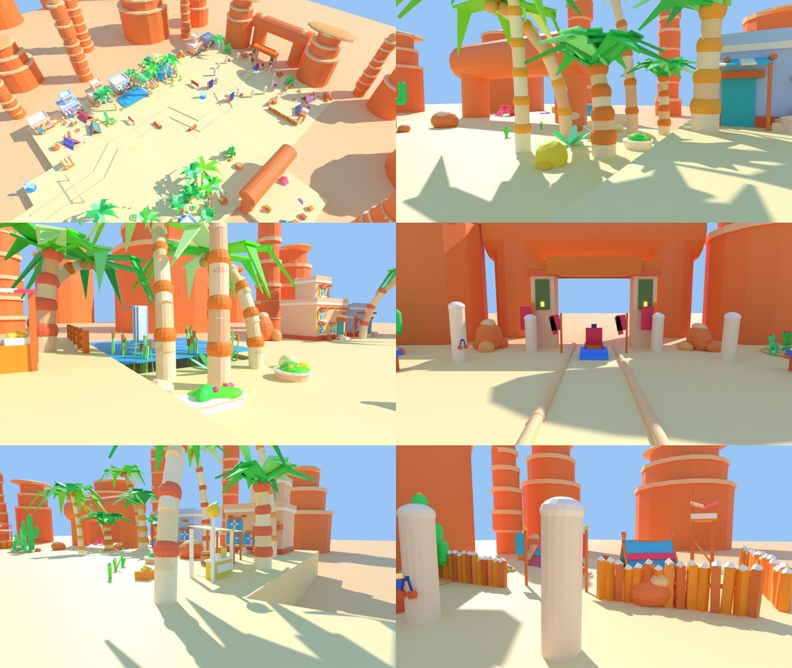

# Iron Lowlands: the living oasis (2026-09-24)

Alex's brief: the Iron Lowlands looked empty, muddy and dead next to Briarwood and Hearthmere, with
ugly cliffs. The direction chosen was a **lush desert oasis**, with **no townsfolk** (it is an enemy
zone): the life comes from plants, water, animals, wind and sound. Gameplay did not move: every
spawn, gate, waystone, floor slab and collision proxy is where it was, and every new part is
decorative (no collision near play, none in the audit's lanes).

It sits on top of the other session's Iron Lowlands look pass (rock as SmoothPlastic parts in
`desert_rockforms`, the Salt/Concrete terrain, trail kerbs and trailside clusters in
`desert_sand_dressing`), which it keeps as it is.

## What was added (round 2: composed, not scattered)

Alex's round-1 verdict: "a bunch of random stuff all over the place ... crowded", and the palms
"copy and pasted everywhere". So the basin is now composed like a PS99 area: the fighting ground
round the trail and the spawns is open sand, and the dressing is gathered into a handful of themed
places at its edges and round the water. Everything scattered was removed: the round-1 patches of
plants and pebbles, the uniform boulders along the scarp, the loose saguaros, and the clusters that
stood every 12 studs down both sides of the trail. The trail's kerbs are a slim sunk lip now (they
read as logs). 

| Place | What | Where |
|---|---|---|
| Lemonade Corner | the lemonade stand facing the overlook, a shade sail with a bench, a coconut, a young and a date palm, a round flower bed, crates and a barrel; pennants over the trail's start | rim, north-west |
| House gardens | a palm and a long bed before the two west houses | rim, west |
| The date grove | five palms of every age, ferns, lemon bushes, a round bed | mid bench, west |
| The town spring | flower beds at its corners, a fern | mid bench, east |
| The oasis shore | beds, ferns and a lemon bush under the oasis palms | pit, east |
| The bandits' quarter | a stake enclosure round their camp opening toward the arena, a lookout, the haul between the tents, banners at the gap, a broken wall, a rock outcrop | pit, west |
| Cactus gardens (4) | a flowering saguaro, a shorter one, prickly pears, agaves, a barrel cactus and rocks on a sand mound, in a crescent | one to each quarter of open sand |
| Rock outcrops | big rounded coral rocks framing the Briarwood gate and marking the pit's east | pit |

Each bed has one colour story (two bloom colours) instead of every colour at once.

**Palms** (`palm`, `PALM_KINDS`): three kinds (a tall straight **date** palm with a full drooping
crown and dates, a bowed **coconut** palm with long hanging fronds and coconuts, a short bushy
**young** palm with its fronds held up), and every palm takes its own trunk curve, trunk and ring
colours, frond family (lime, leaf green, yellow-green), frond count, length and droop from a stream
seeded by its name. The layout draws are the old ones, so no palm moved. They are planted in groups
of mixed kinds and heights, and all of them sway.

**Runtime, client-only** (`lemonade-game/Map`, map project only):

- `OasisAmbience.client.luau`: 4 parrots wheeling over the pools and basin, 6 butterflies working
  the oasis flower beds, 5 dragonflies darting over the water, 3 tumbleweeds bowling across open
  sand, a slow sway on every `Sway` model near the camera (palms, banners), sparkles on the pools and
  sand wisps off the dunes. It idles when the camera leaves the basin. HubAmbience's butterflies now
  keep to the village's own beds.
- `ZoneAir.client.luau`: while the camera is in the basin by day, moves WorldLook's shade from the
  sky's blue-grey toward a warm sand bounce at the same brightness (the "muddy" grey shade sides).
  It also carries three ambience beds (desert wind, oasis water, bazaar chimes) cross-faded by
  position; **their SoundIds are empty until picked in Studio** (Toolbox > Audio), and empty means
  silent.

## Fixes made on the way

- Palm frond tips are joined to their fronds; the spring's runnels lie on the water sheet. These
  were the four long-standing floating FAILs; `check_map_project.py` now reports **0 FAILs**.
- `build_iron_lowlands` left the scrapped quarry mounds in the registry as "ground", so every later
  `floor_at` saw phantom floors; only the floors actually written stay now.
- `check_support` looked for neighbours against a part's centre column only; it now uses the
  part's full height (a drooping tip or leaning post joins at its end).

## Numbers

Iron Lowlands: about 2,630 parts (3,750 after round 1; about 1,280 before the look passes),
11 PointLights (budget 20).

## Checking it

```
python3 tools/map_forge.py
rojo build map.project.json -o /tmp/lemonade-map.rbxlx
python3 tools/check_map_project.py /tmp/lemonade-map.rbxlx      # 0 FAILs
python3 tools/audit_map.py /tmp/lemonade-map.rbxlx              # lanes clear, lights <= 20
```

In Studio (with Alex, over Rojo): walk from the overlook to the Briarwood gate; check the frame rate
at the bazaar lane and over the pit; watch the wildlife and sway stop when you leave through the
gate; pick the three ambience SoundIds in `ZoneAir.client.luau`.
